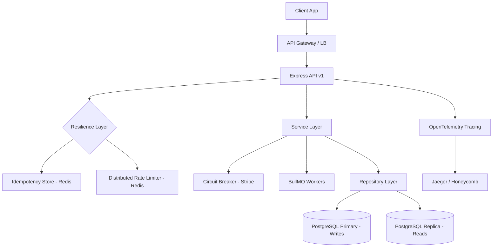

# Marketplace API - Enterprise Backend

## Project Overview

This is a production-grade marketplace backend built with **Node.js** and **TypeScript**. It implements a high-performance, scalable modular architecture designed for high-traffic environments. The system features a clean separation of concerns through repository patterns, dependency injection, asynchronous background processing with BullMQ, and comprehensive production observability.

---

## Architecture Design

The project follows a **FAANG-grade modular architecture**, prioritizing reliability, observability, and horizontal scalability.

### System Flow


## Reliability & Resiliency
- **Idempotency**: `Idempotency-Key` headers ensure atomic execution of mutations (POST/PATCH/DELETE).
- **Circuit Breakers**: External integrations (Stripe) are protected by `opossum` to prevent cascading failures.
- **Graceful Shutdown**: 10-second drain window for HTTP, Workers, and DB connections.
- **Exponential Backoff**: Automated retries for transient network flakiness.

## Scaling Strategy
- **Read/Write Splitting**: Queries are routed to Read Replicas, while mutations hit the Primary database.
- **Background Processing**: Heavy tasks are offloaded to BullMQ workers, ensuring low API latency.
- **Stateless Design**: All session/state is moved to Redis/DB, allowing infinite horizontal scaling of API nodes.

---

## Technology Stack

| Layer | Technology |
| :--- | :--- |
| **API Framework** | Node.js + Express |
| **Language** | TypeScript (Strict Mode) |
| **Database** | PostgreSQL |
| **ORM** | Prisma |
| **Cache & Queue** | Redis + BullMQ |
| **Dependency Injection** | tsyringe |
| **Payments** | Stripe |
| **Observability** | Prometheus + Pino (Structured Logging) |

---

## Architecture Principles

- **Modular Domain Architecture**: Domain-based encapsulation (Auth, Product, Order) for scalability.
- **Separation of Concerns**: Clear boundary between domain logic and infrastructure.
- **Clean Architecture**: Services depend on abstractions (Repository Interfaces) rather than concrete implementations.
- **Event-Driven Design**: Asynchronous side effects via a centralized Event Bus and Background Workers.
- **Production Observability**: Built-in metrics, tracing, and structured logging for monitoring.
- **Type-Safe APIs**: End-to-end type safety using TypeScript.

---

## Project Structure

```text
src/
├── modules/          # Domain-specific modules (Auth, Product, Order, etc.)
├── infrastructure/   # Database, Cache, Messaging, Payments
├── events/           # Domain Event Bus and Event Handlers
├── workers/          # BullMQ Background Workers
├── observability/    # Logger, Metrics, Tracing, Health checks
├── middleware/       # Security, Validation, Error Handling
├── container/        # Dependency Injection Container
├── config/           # Environment configuration
└── utils/            # Shared utilities
```

- **modules/**: Each domain contains its own `controllers`, `services`, `repositories`, `interfaces`, `mappers`, and `validators`.
- **infrastructure/**: Encapsulates third-party drivers and database configuration.
- **events/**: Orchestrates internal communication between decoupled services.

---

## Features

- ✅ **Clean Repository Pattern**: Decoupled data access using interfaces.
- ✅ **Mapper Layer**: Explicit transformation between DB entities and DTOs.
- ✅ **Background Processing**: Reliable job queues for tasks like emails and order processing.
- ✅ **Observability**: Real-time monitoring via Prometheus metrics and health endpoints.
- ✅ **Security**: Helmet, CORS, and robust Rate Limiting out of the box.
- ✅ **Real-time**: High-performance Socket.io integration for instant updates.
- ✅ **Type Safety**: Zod for schema-based request validation.

---

## Example API Request

### Create Product
`POST /api/v1/products`

**Request Body:**
```json
{
  "title": "Wireless Headphones",
  "description": "Premium noise-cancelling headphones",
  "price": 299.99,
  "stock": 50,
  "categoryId": "cat_123",
  "tags": ["electronics", "audio"]
}
```

**Response (201 Created):**
```json
{
  "id": "prod_789",
  "title": "Wireless Headphones",
  "price": 299.99,
  "stock": 50,
  "status": "success"
}
```

---

## Getting Started

### Prerequisites
- Node.js 20+
- PostgreSQL
- Redis
- Docker (optional)

### Installation
1. Clone the repository.
2. Install dependencies:
   ```bash
   npm install
   ```
3. Copy `.env.example` to `.env` and configure your credentials.
4. Generate Prisma client:
   ```bash
   npm run prisma:generate
   ```

### Running Locally
```bash
npm run dev
```

### Testing
```bash
npm test
```

---

## API Documentation
- `GET /health`: System health status (DB, Redis).
- `GET /metrics`: Prometheus performance metrics.
- `GET /api/v1/...`: Application domain endpoints.

## License
MIT
